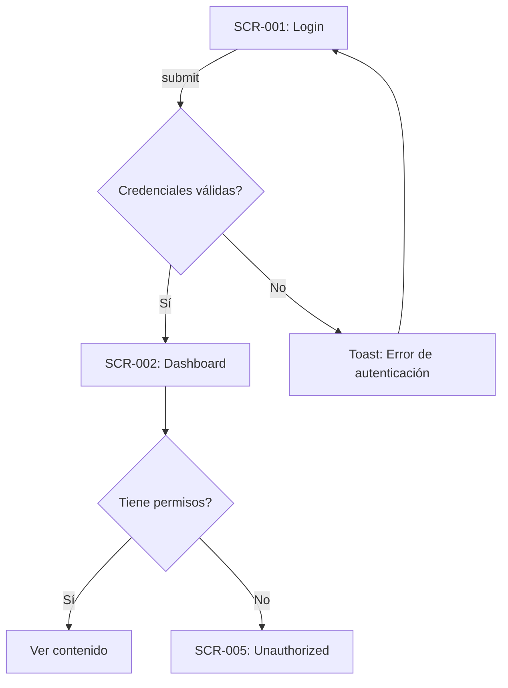

# Design Specification — {{PROJECT_NAME}}

> Generado desde Discovery Brief y Docs por `/design`
> **Fuente:** docs/planning/00_DISCOVERY_BRIEF.md, 01-14
> **SSOT:** Este doc → código UI

---

## 📱 Mapa de Pantallas

| ID      | Pantalla     | URL          | Propósito                  | Acceso       | Stories    |
| ------- | ------------ | ------------ | -------------------------- | ------------ | ---------- |
| SCR-001 | Login        | `/login`     | Autenticación de usuarios  | Público      | US-001     |
| SCR-002 | Dashboard    | `/dashboard` | Vista principal post-login | P-001, P-002 | US-002     |
| SCR-003 | {{pantalla}} | `/{{url}}`   | {{propósito}}              | {{P-XXX}}    | {{US-XXX}} |

**Leyenda de Acceso:**

- `Público` — Sin autenticación
- `P-XXX` — Requiere persona/rol específico

---

## 🎨 Design Tokens

> **Fuente:** `src/app/globals.css`, `tailwind.config.ts`
> **SSOT:** Este doc para tokens de ESTE proyecto

### Colores

| Token           | Valor      | Uso                  | Origen        |
| --------------- | ---------- | -------------------- | ------------- |
| `--background`  | `hsl(...)` | Fondo general        | 🏗️ SK Default |
| `--foreground`  | `hsl(...)` | Texto principal      | 🏗️ SK Default |
| `--primary`     | `hsl(...)` | Acciones principales | 🎨 Custom     |
| `--secondary`   | `hsl(...)` | Acciones secundarias | 🏗️ SK Default |
| `--muted`       | `hsl(...)` | Backgrounds sutiles  | 🏗️ SK Default |
| `--accent`      | `hsl(...)` | Highlights           | 🏗️ SK Default |
| `--destructive` | `hsl(...)` | Errores, eliminar    | 🏗️ SK Default |

### Typography

| Token       | Valor            | Uso              |
| ----------- | ---------------- | ---------------- |
| `font-sans` | Inter, system-ui | Body text        |
| `font-mono` | JetBrains Mono   | Code snippets    |
| `text-sm`   | 0.875rem         | Labels, captions |
| `text-base` | 1rem             | Body             |
| `text-lg`   | 1.125rem         | Subtitles        |
| `text-xl`   | 1.25rem          | Headings         |
| `text-2xl`  | 1.5rem           | Page titles      |

### Spacing

| Token     | Valor         | Uso              |
| --------- | ------------- | ---------------- |
| `space-1` | 0.25rem (4px) | Gaps internos    |
| `space-2` | 0.5rem (8px)  | Padding pequeño  |
| `space-4` | 1rem (16px)   | Padding estándar |
| `space-6` | 1.5rem (24px) | Secciones        |
| `space-8` | 2rem (32px)   | Containers       |

### Breakpoints

| Token | Valor  | Uso              |
| ----- | ------ | ---------------- |
| `sm`  | 640px  | Mobile landscape |
| `md`  | 768px  | Tablet           |
| `lg`  | 1024px | Desktop          |
| `xl`  | 1280px | Wide desktop     |

---

## 🔄 SK Style Migration Assessment

> **Si §0 Visual Direction = SK default (Neumorphism):** ✅ No migration needed.
> **Si difiere:** Completar tabla de impacto.

### Impact Table

| Aspecto           | SK Actual                             | Proyecto             | Acción                                  |
| ----------------- | ------------------------------------- | -------------------- | --------------------------------------- |
| Paradigma visual  | Neumorphism (neo-\*)                  | {{paradigma de §0}}  | ✅ Mantener / 🔧 Override / ❌ Eliminar |
| Temas             | light, dark, midnight                 | {{temas elegidos}}   | ✅/🔧/❌ por tema                       |
| Shadow tokens (9) | `--neo-outset`, `--neo-inset`, etc.   | {{derivar}}          | {{acción}}                              |
| Utility classes   | `neo-outset`, `neo-interactive`, etc. | {{derivar}}          | {{acción}}                              |
| Layout patterns   | Form Card, Internal Scroll, etc.      | {{verificar}}        | {{acción}}                              |
| Nav active states | `neo-inset-sm`                        | {{derivar de shell}} | {{acción}}                              |

### Componentes Afectados

| Componente | Estado actual (design-system.md §7) | Cambio requerido                      |
| ---------- | ----------------------------------- | ------------------------------------- |
| {{comp}}   | {{shadow/state actual}}             | {{nuevo shadow/state o "sin cambio"}} |

**Total:** {{N}} de {{M}} componentes afectados

### Creative Freedom Zone

> Tokens, clases, y patterns **nuevos** que no existen en el SK — invención del design.

| Elemento nuevo  | Tipo                                | Justificación                |
| --------------- | ----------------------------------- | ---------------------------- |
| {{token/clase}} | Token / Clase / Pattern / Animación | {{por qué mejora el diseño}} |

### Migration Estimate

- **Issues estimados:** {{N}} issues de migration para backlog
- **Riesgo:** {{bajo/medio/alto}}
- **DD requerida:** {{Sí (>5 componentes) / No}}

---

## 🧭 Navegación y Sidebar

**Estructura del Sidebar:**

```
┌─────────────────────┐
│ [Logo]              │
├─────────────────────┤
│ 📊 Dashboard        │  → P-001, P-002
│ 👥 Usuarios         │  → P-001 only
│   └─ Lista          │
│   └─ Roles          │
│ ⚙️ Configuración    │  → P-001 only
├─────────────────────┤
│ [Perfil Usuario]    │
└─────────────────────┘
```

**Ítems de Navegación:**

| Ítem          | SCR     | URL                   | Icono           | Acceso       |
| ------------- | ------- | --------------------- | --------------- | ------------ |
| Dashboard     | SCR-002 | `/dashboard`          | LayoutDashboard | P-001, P-002 |
| Usuarios      | SCR-003 | `/dashboard/users`    | Users           | P-001        |
| Configuración | SCR-004 | `/dashboard/settings` | Settings        | P-001        |

**Comportamiento:**

- [ ] Sidebar colapsable en desktop
- [ ] Drawer en mobile
- [ ] Indicador de página activa
- [ ] Submenues expandibles

---

## 🔄 Flujos Principales

### FLW-001: Autenticación

**Descripción:** Usuario inicia sesión en la aplicación.
**Personas:** P-001 (Admin), P-002 (User)
**Stories:** US-001



**Estados:**

- **Happy path:** Login → Dashboard → Contenido
- **Error:** Credenciales inválidas → Toast error → Retry
- **Edge case:** Token expirado → Redirect a login

---

### FLW-002: {{Nombre del Flujo}}

**Descripción:** {{Qué logra el usuario}}
**Personas:** {{P-XXX}}
**Stories:** {{US-XXX}}

```mermaid
graph TD
    A[{{SCR-XXX}}] --> B{{{Decisión}}}
    B -->|Opción 1| C[{{Acción 1}}]
    B -->|Opción 2| D[{{Acción 2}}]
```

**Estados:**

- **Happy path:** {{descripción}}
- **Error:** {{cómo se maneja}}
- **Edge case:** {{casos especiales}}

---

### FLW-003: {{Nombre del Flujo}}

{{Repetir estructura}}

---

## 🧩 Componentes por Pantalla

### SCR-001: Login

**Componentes SK:**
| Componente | Uso | Variante |
|------------|-----|----------|
| Card | Contenedor del form | - |
| Form | Formulario de login | - |
| Input | Email, Password | type="email", type="password" |
| Button | Submit | variant="default" |

**Componentes Nuevos:** —

**Estados:**

- [ ] Default (form vacío)
- [ ] Loading (submitting)
- [ ] Error (credenciales inválidas)
- [ ] Success (redirect)

---

### SCR-002: Dashboard

**Componentes SK:**
| Componente | Uso | Variante |
|------------|-----|----------|
| PageHeader | Título + acciones | - |
| Card | Stat cards | - |
| DataTable | Lista principal | - |

**Componentes Nuevos:**

| ID      | Nombre     | Descripción                   | Prioridad |
| ------- | ---------- | ----------------------------- | --------- |
| CMP-001 | StatCard   | Card con métrica, trend, icon | P1        |
| CMP-002 | {{nombre}} | {{descripción}}               | P1/P2/P3  |

**Estados:**

- [ ] Loading (Skeleton)
- [ ] Empty (EmptyState)
- [ ] Error (Error boundary)
- [ ] Con datos

---

### SCR-XXX: {{Pantalla}}

{{Repetir estructura}}

---

## 📊 Data Requirements

### Server Components (Fetch)

| SCR     | Data     | Server Action         | Cache     | Revalidate     |
| ------- | -------- | --------------------- | --------- | -------------- |
| SCR-002 | Stats    | `getDashboardStats()` | 1h        | on-demand      |
| SCR-003 | Users    | `getUsers()`          | none      | on mutation    |
| {{SCR}} | {{data}} | {{action}}            | {{cache}} | {{revalidate}} |

### Client Mutations

| Acción      | Server Action  | Optimistic UI | Revalidation  |
| ----------- | -------------- | ------------- | ------------- |
| Create user | `createUser()` | No            | `/users`      |
| Update user | `updateUser()` | Sí            | `/users/[id]` |
| {{acción}}  | {{action}}     | Sí/No         | {{paths}}     |

---

## 📋 Decisiones de Diseño

| ID     | Decisión                 | Opciones                          | Elegida     | Razón                                              |
| ------ | ------------------------ | --------------------------------- | ----------- | -------------------------------------------------- |
| DD-001 | Sidebar vs Top Nav       | A) Sidebar colapsable, B) Top nav | A           | Más espacio para contenido, estándar en dashboards |
| DD-002 | Modal vs Page para crear | A) Dialog modal, B) Nueva página  | A           | Operación rápida, no pierde contexto               |
| DD-003 | {{decisión}}             | A/B                               | {{elegida}} | {{razón}}                                          |

---

## Open Questions

| #     | Pregunta                        | Impacto       | Afecta      | Owner     |
| ----- | ------------------------------- | ------------- | ----------- | --------- |
| OQ-01 | ¿Dashboard tiene dark mode?     | Med           | SCR-002+    | Cliente   |
| OQ-02 | ¿Notificaciones en tiempo real? | **Alto**      | FLW-XXX     | Architect |
| OQ-03 | {{pregunta}}                    | Alto/Med/Bajo | {{SCR/FLW}} | {{owner}} |

---

## Assumptions

| #    | Supuesto                                   | Si es incorrecto            |
| ---- | ------------------------------------------ | --------------------------- |
| A-01 | Usuarios tienen email único                | Cambiar validación de login |
| A-02 | Max 100 items en listas sin virtualization | Implementar virtual scroll  |
| A-03 | {{supuesto}}                               | {{impacto}}                 |

---

## 🖼️ Wireframes Textuales

> **OBLIGATORIO:** Un wireframe por cada pantalla SCR-XXX listada en §1.

### SCR-001: Login

```
┌─────────────────────────────┐
│         [Logo]              │
│                             │
│  Email:    [____________]   │
│  Password: [____________]   │
│                             │
│       [   Login   ]         │
│   ──────── or ────────      │
│  [Google]  [GitHub]         │
│                             │
│  Forgot password? · Register│
└─────────────────────────────┘
```

- Mobile: Stack vertical, full-width inputs
- States: loading spinner on submit, error toast
- RBAC: público (no requiere sesión)

### SCR-002: Dashboard

```
┌────────────────────────────────────────────────────┐
│ [Logo]  Nav1  Nav2  Nav3             [Avatar ▼]    │
├────────────────────────────────────────────────────┤
│                                                    │
│  Dashboard                           [+ Action]    │
│                                                    │
│  ┌──────────┐ ┌──────────┐ ┌──────────┐           │
│  │ Stat 1   │ │ Stat 2   │ │ Stat 3   │           │
│  │ 1,234 ▲  │ │ 567 ▼    │ │ 89%      │           │
│  └──────────┘ └──────────┘ └──────────┘           │
│                                                    │
│  Lista Principal                                   │
│  ┌──────────────────────────────────────────────┐  │
│  │ [x] Name    Email         Role    Actions    │  │
│  │ [ ] John    john@...      Admin   [...]     │  │
│  │ [ ] Jane    jane@...      User    [...]     │  │
│  └──────────────────────────────────────────────┘  │
│                                                    │
│  [Prev] 1 2 3 ... [Next]                          │
│                                                    │
└────────────────────────────────────────────────────┘
```

- Mobile: Stats stack vertical, tabla horizontal scroll
- States: loading (skeleton), empty (EmptyState), error (boundary), con datos
- RBAC: P-001 (Admin), P-002 (User)

### SCR-XXX: {{Pantalla}}

```
┌─────────────────────────────┐
│         {{layout}}          │
└─────────────────────────────┘
```

- Mobile: {{adaptación responsive}}
- States: {{loading, empty, error, data}}
- RBAC: {{roles con acceso}}

---

## ✅ Checklist Pre-Backlog

- [ ] Todas las pantallas mapeadas (SCR-XXX)
- [ ] Mínimo 3 flujos documentados (FLW-XXX)
- [ ] Componentes SK identificados por pantalla
- [ ] Componentes nuevos listados (CMP-XXX)
- [ ] Data requirements definidos
- [ ] Estados por pantalla considerados
- [ ] Cross-refs a P/US/BR/E completos
- [ ] Decisiones de diseño documentadas
- [ ] Open Questions con owner asignado
- [ ] Assumptions con impacto definido
- [ ] Wireframes para TODAS las pantallas SCR-XXX (obligatorio)

---

## Referencias

- Discovery Brief: `docs/planning/00_DISCOVERY_BRIEF.md`
- User Personas: `docs/planning/03_USER_PERSONAS.md`
- User Stories: `docs/planning/04_USER_STORIES.md`
- Business Rules: `docs/planning/05_BUSINESS_RULES.md`
- Data Model: `docs/planning/06_DATA_MODEL.md`
- Architecture: `docs/planning/07_ARCHITECTURE.md`

---

_Generado por TimeKast Factory — /design_
