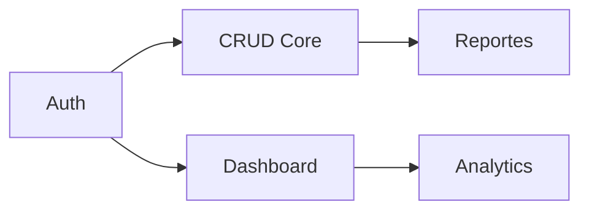

# 📋 Feature Map — {{PROJECT_NAME}}

> Generado desde Discovery Brief §3 por `/docs`
> **Fuente:** `docs/planning/00_DISCOVERY_BRIEF.md`
> **SSOT:** Este documento define el alcance de features.

---

## 🎯 MVP Features (v1.0)

> Features que **DEBEN** estar en el primer release.

| FT     | Feature          | Descripción           | Deps   | Riesgo | Owner     |
| ------ | ---------------- | --------------------- | ------ | ------ | --------- |
| FT-001 | {{feature_name}} | {{descripción corta}} | —      | Med    | {{owner}} |
| FT-002 | {{feature_name}} | {{descripción corta}} | FT-001 | Low    | {{owner}} |
| FT-003 | {{feature_name}} | {{descripción corta}} | FT-001 | High   | {{owner}} |

**Total MVP:** {{N}} features

---

## 📋 Post-MVP Features

> Features para versiones futuras, ya identificadas.

| FT     | Feature          | Descripción     | Deps   | Target | Riesgo |
| ------ | ---------------- | --------------- | ------ | ------ | ------ |
| FT-010 | {{feature_name}} | {{descripción}} | FT-002 | v1.1   | Med    |
| FT-011 | {{feature_name}} | {{descripción}} | FT-003 | v1.2   | Low    |

---

## 🚫 Non-Goals (Explícitamente fuera de scope)

> Lo que **NO** haremos. Esto previene scope creep.

| NG     | Non-Goal             | Razón          | Reconsiderar en              |
| ------ | -------------------- | -------------- | ---------------------------- |
| NG-001 | {{feature excluido}} | {{por qué no}} | {{versión futura o "nunca"}} |
| NG-002 | {{feature excluido}} | {{por qué no}} | {{versión futura}}           |

---

## 📊 Resumen

| Métrica              | Valor  |
| -------------------- | ------ |
| Features MVP         | {{X}}  |
| Features Post-MVP    | {{Y}}  |
| Non-Goals declarados | {{Z}}  |
| Cobertura de §3      | {{A}}% |

---

## Reglas de Trazabilidad

1. **Toda User Story (US-XXX) debe referenciar un FT-XXX**
2. **Todo Screen (SCR-XXX) debe mapear a un FT-XXX**
3. **Todo Issue del backlog debe referenciar FT-XXX**

---

## Dependencias Visuales

---

## Open Questions

| #     | Pregunta                 | Impacto           | Owner       |
| ----- | ------------------------ | ----------------- | ----------- |
| OQ-01 | {{pregunta sobre scope}} | **Alto**/Med/Bajo | Cliente/Dev |

---

## Assumptions

| #    | Supuesto              | Si es incorrecto           |
| ---- | --------------------- | -------------------------- |
| A-01 | {{supuesto de scope}} | Impacto: {{qué cambiaría}} |

---

_Generado por TimeKast Factory — /docs_
